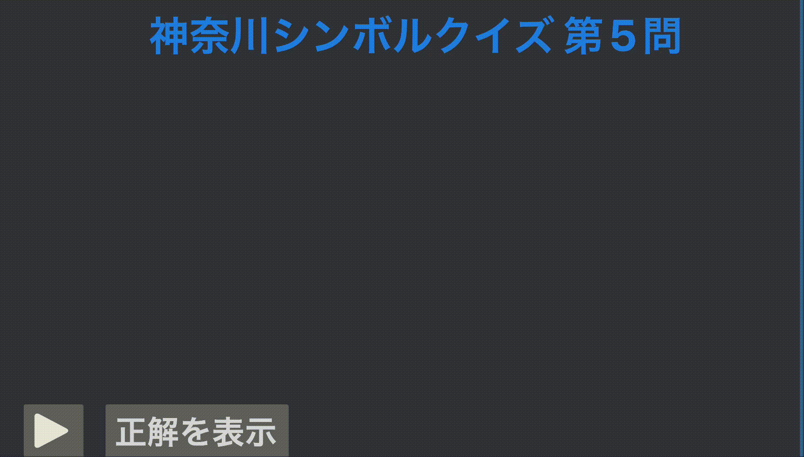

## SymbolKit

This function was announced in [Chiba.swift #1](https://chibaswift.connpass.com/event/328367/) and an enhanced version was released as `SymbolKit` in [Kanagawa.swift #1](https://kanagawaswift.connpass.com/event/332163/).  
`SymbolKit` provides a quiz feature using SwiftUI Path.  
The example below shows the custom path indicating [Enoshima](https://maps.app.goo.gl/zSccEdrTQirL2DKC9) with animation.


```
SymbolQuizView(
    titleContent: {
        Text("神奈川シンボルクイズ第5問")
            .font(.largeFont)
            .foregroundStyle(.themeColor)
    }, answerPrefixContent: {
        Text("正解:")
            .font(.midiumFont)
            .foregroundStyle(.defaultForegroundColor)
    }, answerContent: {
        Text("江ノ島")
            .font(.largeFont)
            .foregroundStyle(.strokeColor)
    }, showAnswerContent: {
        Text("正解を表示")
            .font(.midiumFont)
            .foregroundStyle(.defaultForegroundColor)
    }, answerHintContent: {
        Text(answerHint ?? "")
            .font(.midiumFont)
            .foregroundStyle(.defaultForegroundColor)
    },
    shape: EnoshimaShape(),
    // Set Path Aspect ratio
    shapeAspectRatio: 990 / 617
)
```

`SymbolQuizView` has custom shortcuts.

1. `Space` -> start / stop path animation
2. `Cmd` + `u` -> show incorrect mark(❌)
3. `Cmd` + `c` -> show correct mark(⭕️)

### Font
This project depends on [Hefty Reward Single Line Font](https://www.fontspace.com/hefty-reward-single-line-font-f97212).  
This font is allowed only for personal use, not for any commercial use.